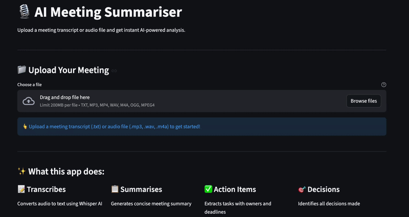

# 🎙️ AI Meeting Summariser

An AI-powered meeting analysis tool that converts audio or text 
transcripts into structured summaries, action items, and decisions.

## 📺 Demo


## ✨ Features
- Upload audio files (MP3, WAV, M4A) or text transcripts
- Auto transcription using OpenAI Whisper
- AI-powered analysis using Mistral LLM via Ollama
- Extracts meeting summary, action items, decisions, key points
- Download full analysis report

## 🛠️ Tech Stack
- Python
- OpenAI Whisper (speech to text)
- Mistral LLM via Ollama (local, free, no API key)
- LangChain
- Streamlit

## ⚙️ How to Run Locally
```bash
pip install -r requirements.txt
ollama pull mistral
streamlit run app.py
```